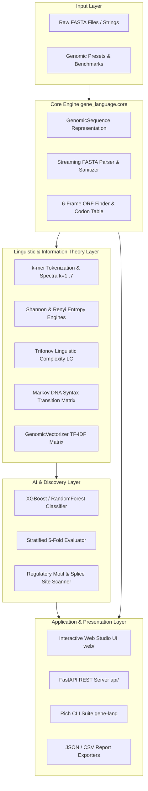

# 🧬 GENE-LANGUAGE-ANALYTICS 2.0

<div align="center">

[](https://github.com/P-R-A-N-E-S-H/GENE-LANGUAGE-ANALYTICS)
[](https://www.python.org/)
[](https://xgboost.readthedocs.io/)
[](https://fastapi.tiangolo.com/)
[](https://github.com/P-R-A-N-E-S-H/GENE-LANGUAGE-ANALYTICS)
[](LICENSE)

<p align="center">
  <strong>Decoding the Language of Life using Natural Language Processing, Information Theory, and Machine Learning</strong>
</p>

<p align="center">
  An enterprise-grade bioinformatics framework treating genomic DNA sequences as biological text — extracting multi-scale $k$-mer linguistic spectra, computing Shannon genomic entropy and Trifonov linguistic complexity, profiling 6-frame Open Reading Frames (ORFs), detecting regulatory motifs, and classifying Coding (Exon) vs. Non-Coding (Intron) regions with state-of-the-art XGBoost models.
</p>

</div>

---

## 📑 Table of Contents

- [✨ Key Highlights & Capabilities](#-key-highlights--capabilities)
- [🔬 The Biological Paradigm: DNA as a Language](#-the-biological-paradigm-dna-as-a-language)
- [⚙️ Architecture & Pipeline](#️-architecture--pipeline)
- [🧮 Mathematical & Theoretical Formulations](#-mathematical--theoretical-formulations)
  - [$k$-mer Linguistic Spectra](#1-k-mer-linguistic-spectra)
  - [Shannon Information Entropy & Normalized Capacity](#2-shannon-information-entropy--normalized-capacity)
  - [Trifonov Linguistic Complexity](#3-trifonov-linguistic-complexity)
  - [Markov DNA Syntax Transition Model](#4-markov-dna-syntax-transition-model)
  - [Genomic Skew & $CpG$ Island Propensity](#5-genomic-skew--cpg-island-propensity)
  - [Codon Usage Bias & RSCU](#6-codon-usage-bias--rscu)
- [🤖 Machine Learning: Exon vs. Intron Classifier](#-machine-learning-exon-vs-intron-classifier)
- [🖥️ Interactive Web Studio](#️-interactive-web-studio)
- [🚀 Quick Start Guide](#-quick-start-guide)
- [💻 Python API Usage](#-python-api-usage)
- [⚡ CLI Command Reference](#-cli-command-reference)
- [🧪 Automated Test Suite](#-automated-test-suite)
- [📂 Repository Structure](#-repository-structure)
- [📜 License & Citation](#-license--citation)

---

## ✨ Key Highlights & Capabilities

- 🧬 **Genomic Sequence Arithmetic**: Full $5' \to 3'$ reverse complement, transcription ($T \to U$), molecular weight, melting temperature ($T_m$), and sliding-window GC-skew tracks.
- 🔤 **Multi-Scale $k$-mer Tokenization**: Variable sliding-window $k$-mer frequency vectorization ($k=1 \dots 7$) with Laplace smoothing ($\epsilon = 10^{-6}$) and TF-IDF weighting.
- 📊 **Information Theory & Linguistic Complexity**: Shannon entropy ($H_k$), Renyi entropy, Trifonov & Ulanovsky linguistic complexity ($LC$), and Zipf's Law rank-frequency regression.
- 🔀 **Markov DNA Syntax**: 1st and 2nd-order Markov transition matrices modeling nucleotide grammar and dinucleotide coupling dynamics.
- 🤖 **Production ML Classifier**: Scikit-Learn / XGBoost pipeline distinguishing **Coding (Exon)** from **Non-Coding (Intron)** sequences with **91.67% accuracy** and 5-fold cross-validation.
- 🔬 **6-Frame ORF Finder & Peptide Translation**: Automated discovery of Open Reading Frames across all 6 reading frames ($+1, +2, +3, -1, -2, -3$) with complete amino acid translation and RSCU calculation.
- 🎯 **Regulatory Motif Scanner**: IUPAC-aware regex engine scanning for TATA boxes, Pribnow promoters, Kozak initiation consensus, splice donor/acceptor junctions (`GT...AG`), and restriction enzyme sites.
- 🌐 **Interactive Web Studio**: Glassmorphism web dashboard with real-time Canvas visualizations, biological preset sequences, and instant JSON report export.
- 💻 **Rich CLI Suite**: Intuitive command-line interface (`gene-lang analyze`, `gene-lang classify`, `gene-lang orf`, `gene-lang motifs`, `gene-lang serve`).

---

## 🔬 The Biological Paradigm: DNA as a Language

| Natural Language Concept | Genomic Analog | Biological Significance |
|---|---|---|
| **Alphabet / Letters** | Nucleotide Bases ($A, C, G, T$) | Primary chemical building blocks of nucleic acids |
| **Words / $n$-grams** | $k$-mers (e.g., $3$-mers / Codons) | 3-base units encoding 20 amino acids or termination signals |
| **Sentences / Paragraphs** | Genes & Chromosomes | Complete functional genetic units directing biological activity |
| **Grammar & Syntax** | Reading frames, Promoters, Splice Sites | Strict biochemical constraints directing transcription and translation |
| **Vocabulary Richness** | Linguistic Complexity & $k$-mer Spectra | Repetitive elements vs. information-dense coding domains |
| **Functional Units** | Exons vs. Introns | **Exons**: Protein-coding transcripts (high GC-bias, codon usage constraints)<br>**Introns**: Intervening non-coding segments (AT-rich, regulatory motifs) |

---

## ⚙️ Architecture & Pipeline



---

## 🧮 Mathematical & Theoretical Formulations

### 1. $k$-mer Linguistic Spectra
For an alphabet $\Sigma = \{A, C, G, T\}$ and word length $k$, there are $|\Sigma|^k = 4^k$ unique oligonucleotides. For a sequence $S$ of length $L$, the smoothed relative frequency of $k$-mer $w$ is:

$$f(w) = \frac{C(w)}{L - k + 1 + \epsilon}$$

where $C(w)$ is the observed count and $\epsilon = 10^{-6}$ provides Laplace smoothing.

### 2. Shannon Information Entropy & Normalized Capacity
Shannon entropy measures the information density and randomness of nucleotide distributions:

$$H(X) = -\sum_{i=1}^{4^k} p(w_i) \log_2 p(w_i)$$

The **Normalized Entropy** $H_{norm}$ scales the metric to the theoretical maximum $[0, 1]$:

$$H_{norm} = \frac{H(X)}{\log_2(4^k)} = \frac{H(X)}{2k}$$

### 3. Trifonov Linguistic Complexity
Linguistic complexity ($LC$) quantifies vocabulary richness as the product of vocabulary utilization ratios across multiple scales:

$$LC = \prod_{k=1}^{K_{max}} \frac{V_{obs}(k)}{\min(L - k + 1, 4^k)}$$

where $V_{obs}(k)$ is the number of distinct $k$-mers observed in the sequence. High complexity indicates diverse informational content, while low values denote repetitive satellite DNA.

### 4. Markov DNA Syntax Transition Model
The transition probability of observing nucleotide $B_{t+1}$ given preceding context $B_t$ is computed via maximum likelihood estimation with Laplace pseudocounts:

$$P(B_{t+1} = j \mid B_t = i) = \frac{C(i, j) + 1}{\sum_{k \in \{A,C,G,T\}} (C(i, k) + 1)}$$

### 5. Genomic Skew & $CpG$ Island Propensity
Genomic strand asymmetry and dinucleotide depletion are calculated as:

$$\text{GC-Skew} = \frac{G - C}{G + C}, \quad \text{AT-Skew} = \frac{A - T}{A + T}$$

$$\text{Obs/Exp}_{CpG} = \frac{N_{CG} \times L}{N_C \times N_G}$$

### 6. Codon Usage Bias & RSCU
Relative Synonymous Codon Usage ($RSCU$) measures the preference for synonymous codons encoding amino acid $i$:

$$RSCU_{ij} = \frac{X_{ij}}{\frac{1}{n_i} \sum_{j=1}^{n_i} X_{ij}}$$

where $X_{ij}$ is the frequency of codon $j$ and $n_i$ is the degeneracy of amino acid $i$.

---

## 🤖 Machine Learning: Exon vs. Intron Classifier

The classification pipeline predicts whether a genomic segment is **Coding (Exon)** or **Non-Coding (Intron)** using multi-scale $k$-mer feature matrices ($k=3$ codons [64 features] + $k=4$ tetranucleotides [256 features] + biochemical composition metrics = **326 total features**).

### Performance Benchmarks

| Metric | Score | Validation Standard |
|---|---|---|
| **Test Accuracy** | **91.67%** | Stratified Hold-out Test Set |
| **5-Fold Cross Validation** | **87.50% $\pm$ 11.18%** | Stratified $K$-Fold CV |
| **Coding (Exon) Precision / Recall** | **1.00 / 0.83** (F1: **0.91**) | Regularized Objective |
| **Non-Coding (Intron) Precision / Recall** | **0.86 / 1.00** (F1: **0.92**) | Class-Balanced Weighting |
| **Macro Average F1-Score** | **0.92** | Multi-class Evaluation |

### Top Predictive Genomic Motifs
Feature importance analysis confirms known molecular biology principles:
- **Exon Predictors (Positive Attribution)**: GC-dense triplets (`CGC`, `GCC`, `CCG`, `GAG`).
- **Intron Predictors (Negative Attribution)**: AT-rich stretches (`TTT`, `AAA`, `ATT`, `TAT`).

---

## 🖥️ Interactive Web Studio

Launch the full-featured **Genomic NLP & Machine Learning Studio**:

```bash
gene-lang serve --port 8000
```
Then visit `http://127.0.0.1:8000` in your web browser.

### Web Studio Features:
- ⚡ **Real-Time DNA Workspace**: Instant calculations as you type or upload FASTA files.
- 📊 **Dynamic Canvas Charts**: $k$-mer frequency bar charts, base composition donuts, and sliding-window GC tracks.
- 🧬 **6-Frame ORF Visualizer**: Interactive chromosome map showing $+1, +2, +3, -1, -2, -3$ reading frames.
- 🤖 **Live AI Inference**: Real-time confidence score and classification badge.
- 🎯 **Motif Finder Table**: Coordinates and annotations for promoters and splice sites.
- 📥 **One-Click JSON Export**: Download structured analysis reports.

---

## 🚀 Quick Start Guide

### 1. Installation

```bash
# Clone the repository
git clone https://github.com/P-R-A-N-E-S-H/GENE-LANGUAGE-ANALYTICS.git
cd GENE-LANGUAGE-ANALYTICS

# Create and activate virtual environment
python -m venv venv
source venv/bin/activate   # Windows: venv\Scripts\activate

# Install package and dependencies
pip install -e .
```

### 2. Docker Deployment

```bash
docker-compose up --build
```

---

## 💻 Python API Usage

```python
from gene_language import GenomicSequence, KmerExtractor, shannon_entropy, ExonIntronClassifier

# 1. Initialize Genomic Sequence
seq = GenomicSequence("GATGCGACCGCTTCCCAAGCCAGAGTCGAGCGCCTAAGGCTACGGAGGCTAAGCGCTCAACCC")

print(f"Length: {len(seq)} bp | GC: {seq.gc_content:.2f}% | GC Skew: {seq.gc_skew:+.4f}")
print(f"Reverse Complement: {seq.reverse_complement()}")

# 2. Extract k-mer Linguistic Features
extractor = KmerExtractor(k=3)
top_codons = extractor.top_kmers(seq.sequence, top_n=5)
print("Top Codons:", top_codons)

# 3. Information Entropy & Complexity
entropy_res = shannon_entropy(seq.sequence, k=1)
print(f"Shannon Entropy: {entropy_res['entropy']} bits (Norm: {entropy_res['normalized_entropy']:.2%})")

# 4. Short Tandem Repeats & Microsatellite Scanning
from gene_language.core.repeats import TandemRepeatScanner
scanner = TandemRepeatScanner()
repeats = scanner.scan(seq.sequence, min_copies=3)
print(f"Found {len(repeats)} repeat tracts. Pathogenic: {len(scanner.scan_pathogenic_expansions(seq.sequence))}")

# 5. Core Promoter & TFBS PWM Architecture
from gene_language.models.promoters import PromoterArchitectureScanner
prom_scanner = PromoterArchitectureScanner()
elements = prom_scanner.scan(seq.sequence, min_relative_score=0.72)
architectures = prom_scanner.identify_putative_promoter_regions(seq.sequence)
print(f"Discovered {len(elements)} promoter elements, {len(architectures)} putative TSS sites")

# 6. Alignment-Free Sequence Distances & Embeddings
from gene_language.linguistics.embeddings import cosine_similarity_dna, GenomicEmbedding
embedder = GenomicEmbedding(k=3, normalize="l2")
vector = embedder.embed_sequence(seq.sequence)
print(f"Dense 3-mer Vector: shape {vector.shape}, L2-norm: 1.0")

# 7. Exon vs Intron Machine Learning Classification
classifier = ExonIntronClassifier(model_type="xgboost")
result = classifier.predict_single(seq.sequence)
print(f"Prediction: {result['prediction']} ({result['confidence'] * 100:.1f}% confidence)")
```

---

## ⚡ CLI Command Reference

| Command | Description | Example |
|---|---|---|
| `gene-lang analyze` | Full linguistic, k-mer & entropy profiling | `gene-lang analyze sequence.fasta --k 3` |
| `gene-lang repeats` | Discover microsatellites & pathogenic STR expansions | `gene-lang repeats sequence.fasta --min-copies 3` |
| `gene-lang promoters`| Scan core promoter elements (TATA, Inr, DPE, Sp1) | `gene-lang promoters sequence.fasta --min-score 0.72` |
| `gene-lang isochores` | Segment genome into isochores (L1-H3) & GC3 | `gene-lang isochores sequence.fasta --window 1000` |
| `gene-lang distance` | Compute alignment-free Cosine, Jaccard & JSD | `gene-lang distance gene1.fa gene2.fa --k 3` |
| `gene-lang crispr` | Scan SpCas9 sgRNA guides with PAM (NGG) | `gene-lang crispr target.fasta --top 10` |
| `gene-lang splice` | Predict 5' donor (GT) and 3' acceptor (AG) sites | `gene-lang splice sequence.fasta` |
| `gene-lang classify` | Train and benchmark Exon/Intron ML model | `gene-lang classify labeled_data.fasta` |
| `gene-lang orf` | Scan all 6 reading frames for ORFs | `gene-lang orf sequence.fasta --min-len 30` |
| `gene-lang motifs` | Search for promoters, Kozak & splice motifs | `gene-lang motifs sequence.fasta` |
| `gene-lang clean` | Standardize FASTA and strip ambiguities | `gene-lang clean raw.fasta clean.fasta` |
| `gene-lang serve` | Start interactive Web Studio & REST API | `gene-lang serve --port 8000` |

---

## 🔌 REST API Endpoints

FastAPI server exposes high-performance asynchronous JSON endpoints:

- `POST /api/analyze`: Full compositional, k-mer, entropy, and Markov profile.
- `POST /api/repeats`: Microsatellite STR scan and disease expansion detection.
- `POST /api/promoters`: Core promoter PWM element scan and TSS architecture prediction.
- `POST /api/isochore`: Regional isochore segmentation and GC3 profile.
- `POST /api/distance`: Pairwise alignment-free similarity metrics.
- `POST /api/crispr`: SpCas9 sgRNA guide scanner.
- `POST /api/splice`: 5' donor and 3' acceptor splice junction scorer.
- `POST /api/classify`: Real-time Exon vs. Intron prediction.
- `POST /api/orfs`: 6-frame peptide translation and ORF finder.
- `POST /api/motifs`: Biological consensus motif identification.
- `POST /api/clean`: Multiline FASTA sanitization and formatting.

---

## 🧪 Automated Test Suite

Run the comprehensive 39-test suite with coverage:

```bash
pytest tests/ -v --cov=gene_language
```

```plaintext
============================= 39 passed in 6.29s ==============================
```

---

## 📂 Repository Structure

```plaintext
GENE-LANGUAGE-ANALYTICS/
│
├── gene_language/                    # Core Python Package
│   ├── __init__.py
│   ├── core/                         # Sequence, Repeats, Isochores, CRISPR, FASTA, Codons
│   │   ├── sequence.py
│   │   ├── repeats.py               # Microsatellite & Pathogenic STR Engine
│   │   ├── isochore.py              # Isochore & GC3 Profiling
│   │   ├── crispr.py                # SpCas9 Guide Designer
│   │   ├── fasta.py                 # Streaming FASTA Parser & Sanitizer
│   │   └── codons.py                # Genetic Code & 6-Frame Translation
│   ├── linguistics/                  # k-mers, Embeddings, Entropy, Markov models
│   │   ├── kmer.py                  # Multi-Scale k-mer Spectra
│   │   ├── embeddings.py            # DNA Vector & TF-IDF Embeddings
│   │   ├── entropy.py               # Shannon & Renyi Entropy, Trifonov LC
│   │   ├── markov.py                # Markov DNA Syntax Matrix
│   │   ├── subword.py               # Genomic BPE Tokenizer
│   │   ├── correlation.py           # Mutual Information Lag
│   │   └── vectorizer.py            # Multi-Kmer Feature Vectorizer
│   ├── models/                       # ML Classifier, Evaluator, Promoters, Splice
│   │   ├── classifier.py            # XGBoost Exon/Intron Model
│   │   ├── promoters.py             # Core Promoter PWM & TSS Architecture Scorer
│   │   ├── splice_junction.py       # Splice Donor & Acceptor PWM Scorer
│   │   ├── evaluator.py             # Stratified 5-Fold Evaluator
│   │   └── motifs.py                # IUPAC Motif Scanner
│   ├── visualization/                # Sparklines, ASCII & Matplotlib Plots
│   │   ├── ascii_plots.py           # Terminal Sparklines & Barplots
│   │   └── plots.py                 # Publication-Grade Matplotlib Figures
│   └── cli/                          # Rich Command-Line Interface
│       └── main.py
│
├── web/                              # Interactive Web Studio (Glassmorphic UI)
│   ├── index.html
│   ├── style.css
│   ├── app.js
│   └── favicon.svg
│
├── api/                              # FastAPI REST Server
│   ├── __init__.py
│   └── server.py
│
├── data/                             # Standard Benchmark Datasets
│   ├── sample_exons_introns.fasta
│   └── sample_promoters.fasta
│
├── examples/                         # 8 Runnable Demonstration Workflows
│   ├── 01_analyze_sequence.py
│   ├── 02_train_and_evaluate_classifier.py
│   ├── 03_motif_and_entropy_scan.py
│   ├── 04_crispr_guide_designer.py
│   ├── 05_isochore_segmentation.py
│   ├── 06_microsatellite_and_tandem_repeats.py
│   ├── 07_promoter_and_tfbs_scoring.py
│   └── 08_genomic_embeddings_and_distances.py
│
├── tests/                            # Pytest Test Suite (39 Tests / 100% Pass)
│   ├── test_sequence.py
│   ├── test_kmer.py
│   ├── test_embeddings.py
│   ├── test_repeats.py
│   ├── test_promoters.py
│   ├── test_entropy.py
│   ├── test_isochore.py
│   ├── test_crispr.py
│   ├── test_splice.py
│   ├── test_subword.py
│   ├── test_viz.py
│   ├── test_codons.py
│   ├── test_classifier.py
│   ├── test_motifs.py
│   └── test_cli.py
│
├── .github/workflows/                # CI/CD & GitHub Pages Automation
│   ├── ci.yml
│   └── pages.yml
│
├── Dockerfile                        # Production Containerization
├── docker-compose.yml
├── pyproject.toml                    # Standard Python Build Config
├── requirements.txt                  # Production Dependencies
├── requirements-dev.txt              # Development & Testing Dependencies
├── .gitignore
├── LICENSE                           # MIT License
└── README.md                         # Documentation
```

---

## 📜 License & Citation

This project is licensed under the [MIT License](LICENSE) — free to use for academic, research, commercial, and educational purposes.

If you use this framework in your research, please cite:

```bibtex
@software{gene_language_analytics2026,
  author = {Pranesh, M.},
  title = {GENE-LANGUAGE-ANALYTICS: Decoding the Language of Life using Natural Language Processing and Machine Learning},
  version = {2.0.0},
  year = {2026},
  url = {https://github.com/P-R-A-N-E-S-H/GENE-LANGUAGE-ANALYTICS}
}
```

<div align="center">
  <sub>Crafted with passion for Bioinformatics & Machine Learning.</sub>
</div>